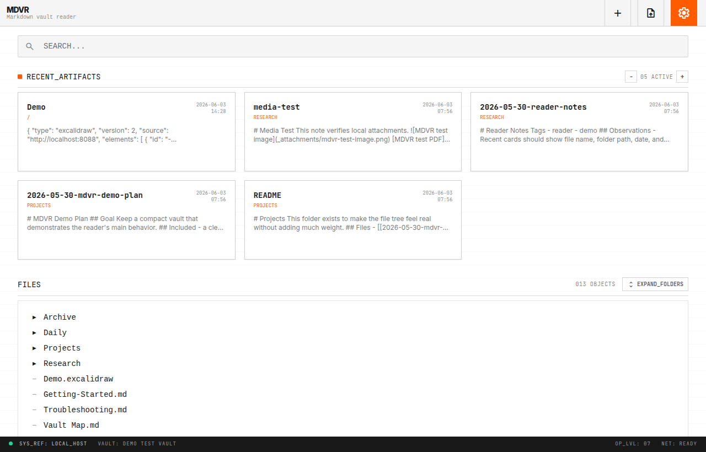
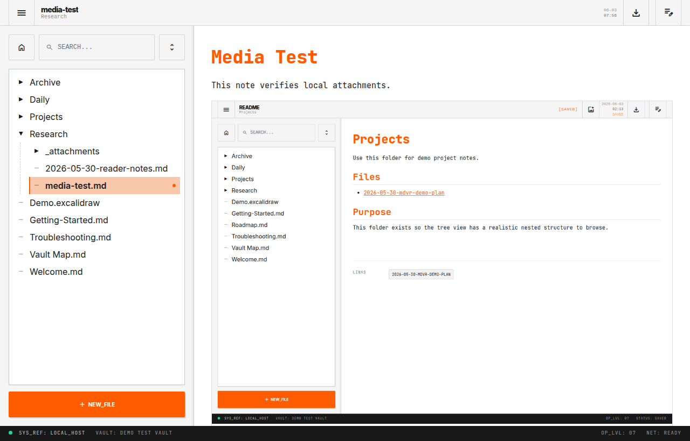
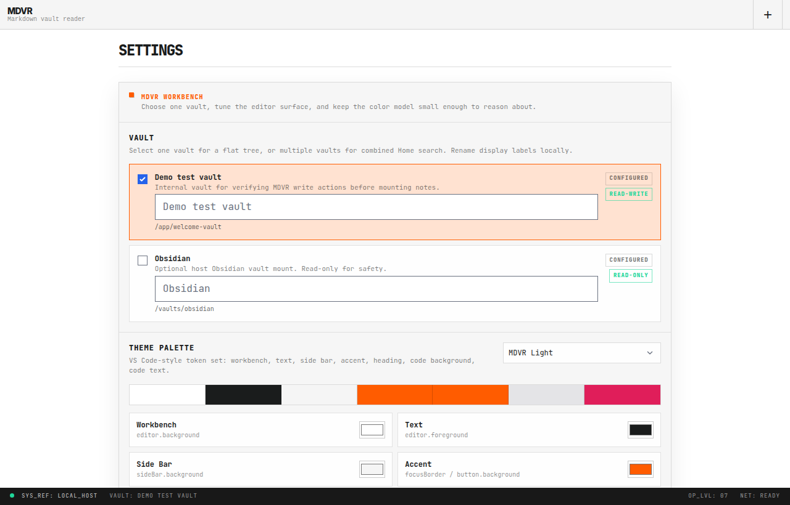

# mdvr (Markdown Vault Reader)

mdvr is a small self-hosted browser app for reading Markdown notes, Excalidraw
files, images, PDFs, and text files from configured vaults. It also has optional
write actions for vaults that are configured as writable.

## Why

I got tired of configuring CouchDB and LiveSync, and I have some devices where I
cannot install third-party apps. I tried to find something similar, but nothing
was a full fit, so I decided to make my own.

The base idea is simple: keep a central vault as the source of truth. Everything
else can read from it, make occasional changes when allowed, and share access
inside a local network or over Tailscale.

This project was created with heavy LLM assistance, but it still took time to
polish and make work reliably. I hope it is useful if you need something
lightweight that works in any web browser.

## Screenshots

| Demo Home | Media Reader | Settings |
| --- | --- | --- |
|  |  |  |

## What it does

- Reads one or more configured vaults from the browser
- Supports folders, recent files, search, tags, links, and backlinks
- Uses stable URLs such as `/demo/Research/note.md`
- Renders local images and first-page PDF previews in Markdown
- Keeps Obsidian-style paths with spaces and underscores intact
- Enforces read/write permissions in the UI and backend
- Uses nginx Basic Auth by default in Docker

## Quick Start

Start the container:

```bash
docker compose up -d --build
```

Open:

```text
http://localhost:8088
```

Default login:

```text
user: mdvr
password: change-me
```

Change the password before exposing mdvr outside a trusted local machine.

Port `8088` is the default host port. The container listens on `8080`, and
Docker maps `8088:8080`. This is a reasonable local default because it avoids
privileged ports and common development ports. If you expose mdvr more broadly,
put it behind a network boundary you trust, such as a reverse proxy, VPN, or
Tailscale.

## Default Vaults

The default Docker setup includes two vault entries:

- `demo`
  - Name: `Demo test vault`
  - Writable
  - Soft-delete enabled
  - Intended for testing create, edit, rename, upload, and delete flows

- `obsidian`
  - Name: `Obsidian`
  - Read-only
  - Mounted from `MDVR_OBSIDIAN_VAULT`, or a local fallback directory
  - Intended as the safe first mount for a real note vault

The Settings page lets you select one or more available vaults. With one vault
selected, the file tree stays flat. With multiple vaults selected, the tree adds
a vault level.

## Add Your Vault

Set `MDVR_OBSIDIAN_VAULT` to your host vault path:

```bash
MDVR_OBSIDIAN_VAULT=/absolute/path/to/vault docker compose up -d
```

The default compose file mounts this vault read-only. Keep that default until
you have checked that links, rendering, and search work as expected.

## Write Access

The demo vault is writable by default so you can test behavior without touching
real notes.

For a real vault, enable writes only when you mean to:

1. Keep auth enabled and change the default password.
2. Make a backup of the vault.
3. Remove the read-only marker from the vault mount.
4. Change that vault mode to `read-write` in the YAML config.

Delete is soft-delete only and must be enabled explicitly. Deleted files move to
`.mdvr-trash`.

## Configuration

mdvr is configured with YAML.

Main defaults:

```yaml
server:
  unknown_keys: fail
  write_without_auth: warn
  auth:
    enabled: true
    realm: MDVR
    user: mdvr
    password: change-me

defaults:
  mode: read-only
  permissions:
    files_format_read: [.md, .excalidraw, .txt, .png, .jpg, .pdf]
    files_format_edit: [.md, .excalidraw, .txt]
    files_format_new: [.md, .excalidraw, .txt]
```

Vault modes:

- `read-only`: read allowed, writes disabled
- `read-write`: create, edit, and rename allowed; delete disabled
- `admin`: create, edit, rename, and soft-delete allowed

Per-vault permissions can override the selected mode. Editable and creatable
file extensions must be included in readable file extensions.

## Links

mdvr uses exact vault-relative paths as file identity.

These are different files:

- `file like this.md`
- `file_like_this.md`

Link examples:

```bash
python tools/mdvr_link.py "Research/note.md"
python tools/mdvr_link.py --vault obsidian "Research/note.md"
python tools/mdvr_link.py --raw "Research/note.md"
```

## Documentation

- [Configuration](docs/configuration.md)
- [Docker](docs/docker.md)
- [Security](docs/security.md)
- [Tailscale](docs/tailscale.md)

## Development

```bash
pip install -r requirements.txt -r requirements-dev.txt
uvicorn main:app --reload --port 8000
pytest -q
```

## License

MIT
